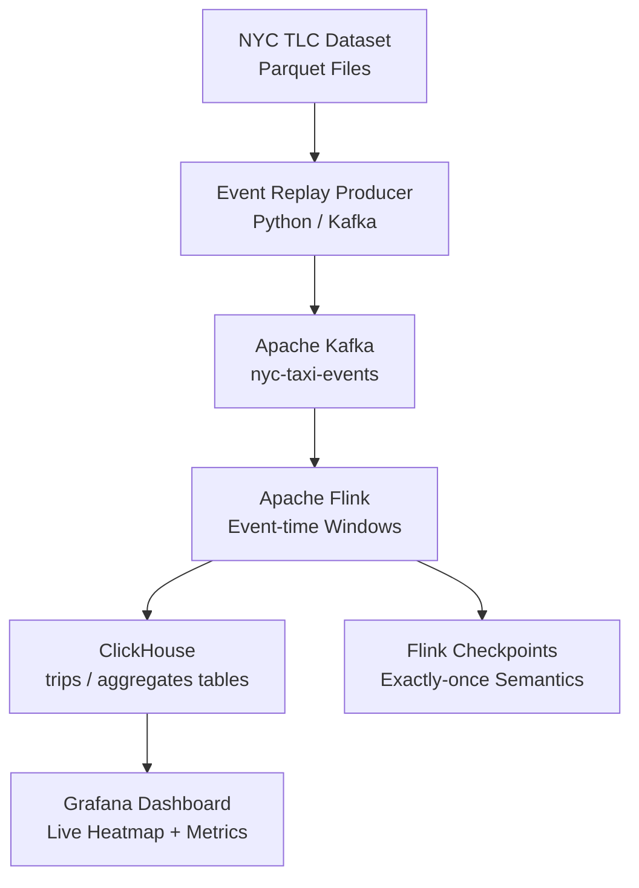

# NYC Taxi Real-time Analytics — Flink + ClickHouse


Real-time streaming analytics on NYC TLC taxi trip data using Apache Flink for event-time processing and ClickHouse for ultra-fast OLAP queries. Simulates live ride events from historical dataset (3M+ records) and computes rolling aggregations per zone, driver, and time window.

## Architecture



## Features

- Realistic event replay from 3M+ historical trip records
- Flink event-time processing with watermarking for late arrivals
- Sliding and tumbling window aggregations (revenue per zone, avg speed)
- ClickHouse ReplicatedMergeTree for horizontal scaling
- Real-time heatmap of pickup/dropoff density by taxi zone
- Grafana dashboard with live refresh (<1s latency)

## Tech Stack

| Layer | Technology |
|-------|-----------|
| Dataset | NYC TLC Trip Data (public) |
| Event Replay | Python Kafka Producer |
| Processing | Apache Flink 1.17 |
| OLAP Store | ClickHouse 23.x |
| Visualization | Grafana |
| Infrastructure | Docker Compose |

## Prerequisites

- Docker & Docker Compose (8GB+ RAM recommended)
- Python 3.10+
- NYC TLC dataset (download link in `data/README.md`)

## Quick Start

```bash
git clone https://github.com/zulham-tech/nyc-taxi-flink-clickhouse.git
cd nyc-taxi-flink-clickhouse
docker compose up -d
python data/download_dataset.py      # downloads ~500MB parquet
python producers/replay_trips.py     # starts event replay
# Grafana: http://localhost:3000
# Flink UI: http://localhost:8081
```

## Project Structure

```
.
├── producers/           # NYC TLC event replay producer
├── flink_jobs/          # Flink DataStream processing jobs
├── clickhouse/          # Schema DDL & materialized views
├── grafana/             # Dashboard JSON with taxi heatmap
├── data/                # Dataset download scripts
├── docker-compose.yml
└── requirements.txt
```

## Author

**Ahmad Zulham Hamdan** — [LinkedIn](https://linkedin.com/in/ahmad-zulham-665170279) | [GitHub](https://github.com/zulham-tech)
